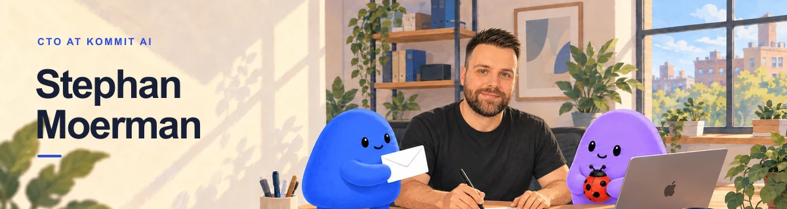

<picture>
  <source media="(prefers-color-scheme: dark)" srcset="./assets/header-dark.webp">
  
</picture>

# Stephan Moerman

**CTO at [Kommit AI](https://getkommit.ai)**

At Kommit, I'm building AI agents that keep follow-up work moving for small businesses. They prepare the next step in the tools teams already use and bring important actions back to a person.

I care about the details that make that handoff dependable: clear ownership, useful context, and the ability to review or say no.

## Elsewhere

[LinkedIn](https://www.linkedin.com/in/stephan-moerman/) · [Website](https://www.moerman.dev) · [Email](mailto:stephan@moerman.dev) · [More writing](https://getkommit.ai/blog/author/stephan-moerman)
