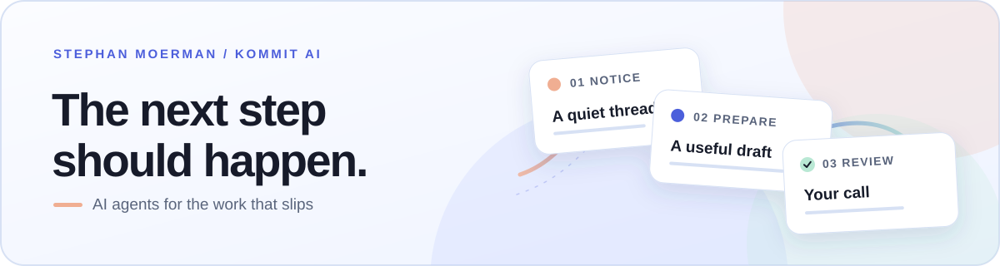

<picture>
  <source media="(prefers-color-scheme: dark)" srcset="./assets/header-dark.svg">
  
</picture>

# Stephan Moerman

**CTO at [Kommit AI](https://getkommit.ai)**

I build for the moment after “we should follow up.”

At Kommit, we're making AI agents for the work that slips between busy days: proposals, missing documents, invoices, and open tasks. They work in the tools teams already use, prepare the next step, and bring client-facing sends to a person for review.

I care about the small decisions that make automation dependable: a clear owner, the right context, and someone who can still say no.

## Notes from the build

- **Sep 2026** · [How Kommit helps you keep control of AI work](https://getkommit.ai/blog/posts/introducing-kommit)
- **May 2026** · [Find out how much time your team spends on repetitive admin](https://getkommit.ai/blog/posts/the-quiet-cost-of-unchased-work)

## Elsewhere

[LinkedIn](https://www.linkedin.com/in/stephan-moerman/) · [Website](https://www.moerman.dev) · [Email](mailto:stephan@moerman.dev) · [More writing](https://getkommit.ai/blog/author/stephan-moerman)

 
